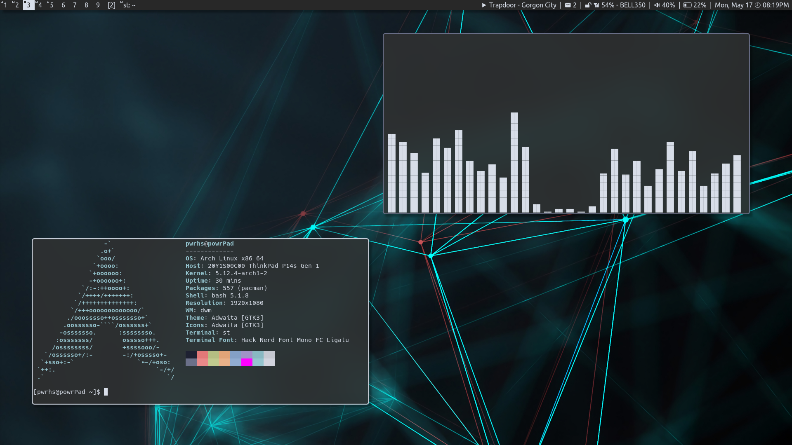

# dotfiles

A collection of scripts and configuration files stored here for backup, remote access, and the perusal of others.

Software I'm currently using:

* Distro: arch
* Window Manager: dwm + dwmblocks
* Terminal: st
* Compositor: picom (ibhagwan fork)
* Browser: firefox
* Music: spotifyd + spotify-tui, cmus
* Visualizer: cava
* Media: mpv
* Notifications: dunst
* Images: sxiv
* Editor: vim
* Fetch: neofetch
* Mail: neomutt, mbsync, msmtp, goimapnotify, mailnotify
* PDFs: zathura
* Fonts: Hack Nerd Font (Ligature patched), Ubuntu Nerd Font
